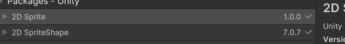
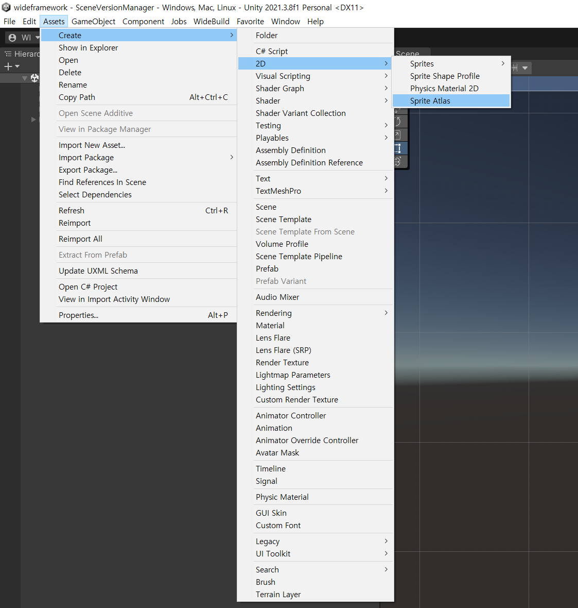
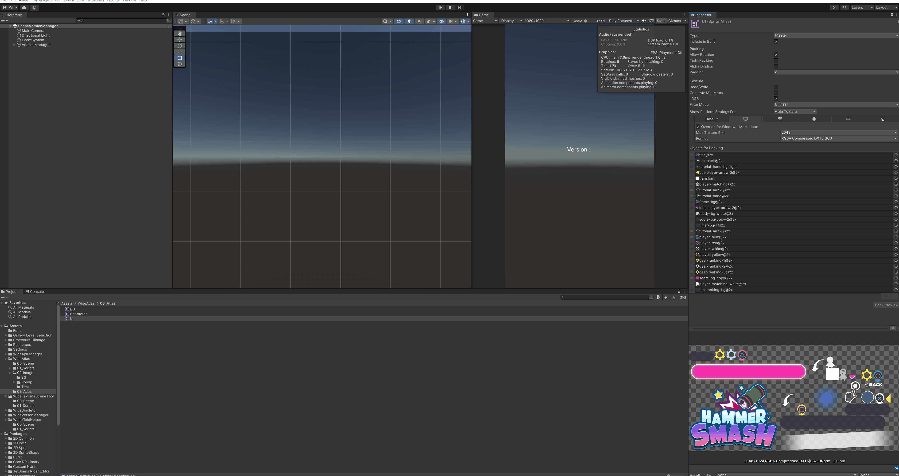
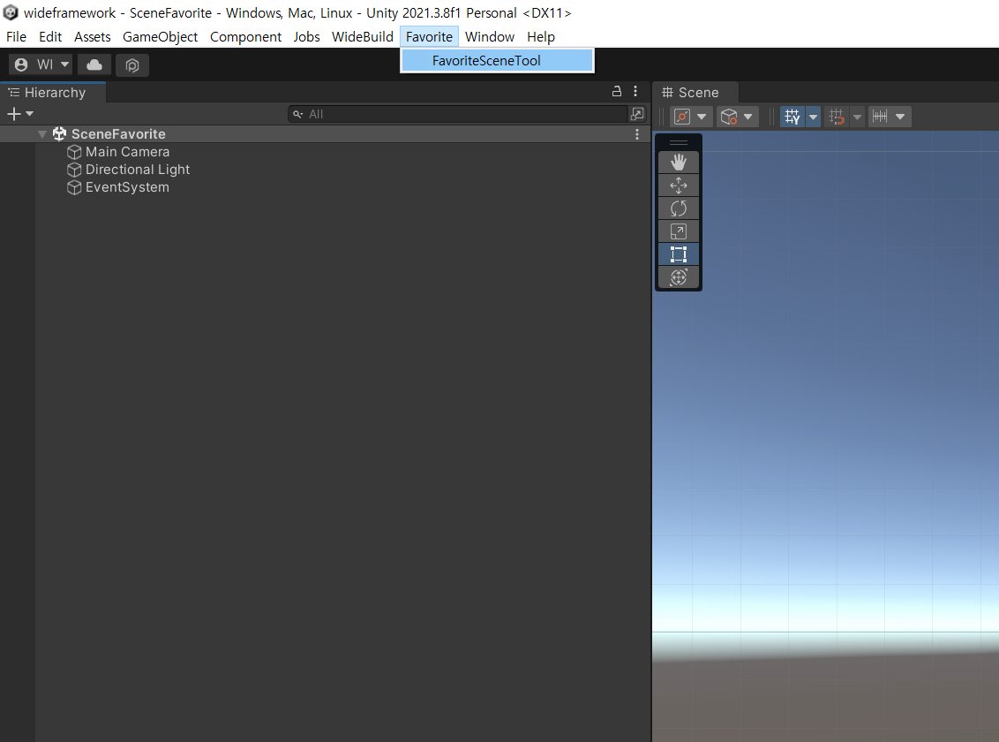
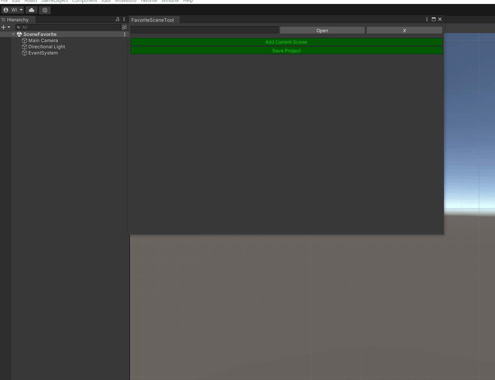

# Widebrain Framework
> 자주 사용하는 기능이나 필요한 기능들의 기능을 모듈화하여 공통으로 사용하기 위함

</br></br>

## WideVersonManager
> 빌드 버전 자동 컨트롤러
 

Menu => WideBuild

    1. Auto Increase Build Version
    true : 빌드버전의 컨트롤을 자동으로 설정 한다 
    false : 자동 빌드설정 컨트롤을 해제 한다

    2. Check Current Version
    현재 버전을 로그에 나타낸다 

    3. Increase Major Version
    메이저 버전 +1 
    ex) 0.0.0 => 1.0.0

    4. Increase Minor Version
    마이너버전 +0.1
    ex) 0.0.0 => 0.1.0

    5. Version Init
    버전 초기화

<br/><br/>


## WideYieldHelper
> 코루틴 컨트롤러

    기존 모바일 플랫폼, pc 버전시 큰 무리없이 개발 가능하지만 webgl 멀티 컨텐츠로 개발방향을 지향하여 
    메모리 누수를 잡기위한 class
``` cs
IEnumerator Start()
    {
        Debug.Log("########### 00 : Start WaitForEndOfFrame");
        yield return Widebrain.Yield.WideYieldHelper.WaitForEndOfFrame();

        yield return Widebrain.Yield.WideYieldHelper.WaitForSeconds(3000);

        Debug.Log("########### 11 : Start WaitForSeconds");
        yield return Widebrain.Yield.WideYieldHelper.WaitForSeconds(3000);


        yield return Widebrain.Yield.WideYieldHelper.WaitForFixedUpdate();
        Debug.Log("########### 22 : Start WaitForFixedUpdate");
        // textVersion.text = $"Version : {Application.version.ToString()}";
    }
}
```
<br/><br/>
## WideAtlas
> 아틀라스 튜토리얼

### 1. Packkage Manager의 2D Sprite, 2D SpriteShape 설치

     
    
<br/>


### 2. Create => 2D => Sprite Atlas 선택 후 Atlas 파일 생성


<br/><br/><br/>

### 3. atlas파일 이미지 추가


<br/><br/><br/>

### 4. Script 사용법

``` cs

using UnityEngine;
using UnityEngine.UI;
using UnityEngine.U2D;

public class WideAtlas : MonoBehaviour
{
    Image _image;
    SpriteAtlas _atlas;

    void StpriteSetting()
    {
        /// 기존 Resources 에서 가져오기
        _image.sprite = Resources.Load<Sprite>("imagePath");
        /// using UnityEngine.U2D 선언 후 
        /// SpriteAtlas 변수 선언 
        /// 아틀라스 배열에 첨부되어있는 이미지네임으로 설정 가능 
        _image.sprite = _atlas.GetSprite("imgName");
    }

}
```

# WideFavoriteSceneTool 
> 자주 사용하는 씬을 에디터상에서 컨트롤

FavoriteSceneTool 생성

        1. 에디터 폴더 생성 (특수폴더명 : Editor)
        2. FavoriteSceneTool.cs 붙여넣기
        3. 상단 Favorite => FavoriteSceneTool 생성



사용법

        1. Open                 : 해당 Scene Open 
        2. X                    : 해당 Scene 툴상에서 삭제 
        3. Add Current Scene    : 추가하고자 하는 Scene 열고 해당 버튼을 입력
        4. Save Pfoject         : 프로젝트 전체 세이브




    
